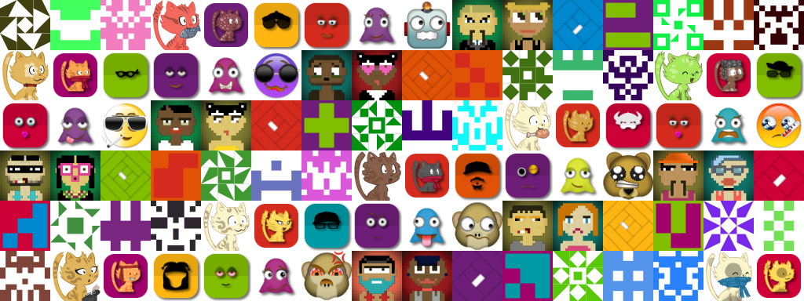
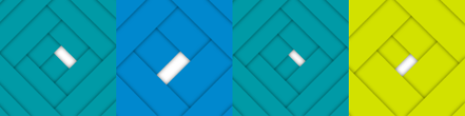
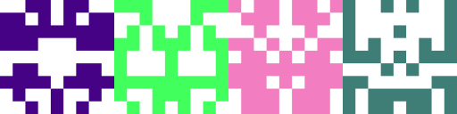
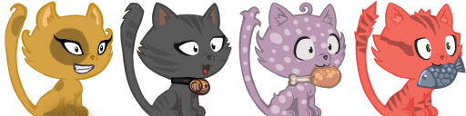

# Avatar Generator

Generator of avatar



## Dependency

In Central Maven :

```xml
<dependency>
    <groupId>com.talanlabs</groupId>
    <artifactId>avatar-generator</artifactId>
    <version>1.1.0</version>
</dependency>
```

## Usage

Use `Avatar avatar = Avatar.newBuilder()...build()`

**Configuration :**

|Method|Description|
|---|---|
| elementRegistry(ElementRegistry elementRegistry) | Registry elements & groups |
| size(int width, int height) | Size of final image |
| padding(int padding) | Add padding in pixel of elements |
| margin(int margin) | Add marge in pixel |
| layers(ILayer... layers) | Add layers to apply in elements |
| color(Color color) | Colorize all elements |
| colorizeFunction(IColorizeFunction colorizeFunction) | Colorize elements |
| cache(ICache cache) | Use cache |

**Create :**

Use `avatar.create...`

|Method|Description|
|---|---|
| BufferedImage create(long code) | Create Avatar as BufferedImage |
| byte[] createAsPngBytes(long code) | Create Avatar as Png byte array |
| void createAsPngToFile(long code, File file) | Create Avatar as Png to file |

## Predefined avatar

### Triangle

**Example 1 :**

```java
Avatar avatar = TriangleAvatar.newAvatarBuilder().build();

avatar.create(123456L);
```

[Sample Triangle1](sample/src/main/java/Triangle1Main.java)



### Square

Source : https://github.com/flouthoc/minBlock.js

**Example 1 :**

```java
Avatar avatar = SquareAvatar.newAvatarBuilder().build();

avatar.create(123456L);
```

[Sample Square1](sample/src/main/java/Square1Main.java)


### Identicon

Source : https://github.com/donpark/identicon

**Example 1 :**

```java
Avatar avatar = IdenticonAvatar.newAvatarBuilder().build();

avatar.create(123456L);
```

[Sample Identicon1](sample/src/main/java/Identicon1Main.java)


### GitHub

**Example 1 :**

```java
Avatar avatar = GitHubAvatar.newAvatarBuilder().layers(new ColorPaintBackgroundLayer(Color.WHITE)).build();

avatar.create(123456L);
```

[Sample GitHub1](sample/src/main/java/GitHub1Main.java)


**Example 2 :**

```java
Avatar avatar = GitHubAvatar.newAvatarBuilder().build();

avatar.create(123456L);
```

[Sample GitHub2](sample/src/main/java/GitHub2Main.java)



### Cat

```xml
<dependency>
    <groupId>com.talanlabs</groupId>
    <artifactId>avatar-generator-cat</artifactId>
    <version>1.1.0</version>
</dependency>
```

Images sources :  CC-By 4.0 attribution: David Revoy https://framagit.org/Deevad/cat-avatar-generator

**Example 1 :**

```java
Avatar avatar = CatAvatar.newAvatarBuilder().build();

avatar.create(123456L);
```

[Sample Cat1](sample/src/main/java/Cat1Main.java)



**Example 2 :**

```java
Avatar avatar = CatAvatar.newAvatarBuilder()
    .layers(new ShadowLayer(), new RandomColorPaintBackgroundLayer(), new RoundRectMaskLayer())
    .padding(8).margin(8).build();

avatar.create(123456L);
```

[Sample Cat2](sample/src/main/java/Cat2Main.java)


### Smiley

```xml
<dependency>
    <groupId>com.talanlabs</groupId>
    <artifactId>avatar-generator-smiley</artifactId>
    <version>1.1.0</version>
</dependency>
```

**Example 1 :**

```java
Avatar avatar = SmileyAvatar.newAccessoriesAvatarBuilder().build();

avatar.create(123456L);
```

[Sample Smiley1](sample/src/main/java/Smiley1Main.java)


**Example 2 :**

```java
Avatar avatar = SmileyAvatar.newEyeMouthAvatarBuilder().build();

avatar.create(123456L);
```

[Sample Smiley2](sample/src/main/java/Smiley2Main.java)


**Example 3 :**

```java
Avatar avatar = SmileyAvatar.newGhostAvatarBuilder().build();

avatar.create(123456L);
```

[Sample Smiley3](sample/src/main/java/Smiley3Main.java)


**Example 4 :**

```java
Avatar avatar = SmileyAvatar.newDefaultAvatarBuilder().build();

avatar.create(123456L);

```

[Sample Smiley4](sample/src/main/java/Smiley4Main.java)


### 8 bit

```xml
<dependency>
    <groupId>com.talanlabs</groupId>
    <artifactId>avatar-generator-8bit</artifactId>
    <version>1.1.0</version>
</dependency>
```

Images sources : https://github.com/o1egl/govatar

**Example 1 :**

```java
Avatar avatar = EightBitAvatar.newMaleAvatarBuilder().build();

avatar.create(123456L);
```

[Sample 8bit1](sample/src/main/java/EightBit1Main.java)


**Example 2 :**

```java
Avatar avatar = EightBitAvatar.newFemaleAvatarBuilder().build();

avatar.create(123456L);
```

[Sample 8bit2](sample/src/main/java/EightBit2Main.java)


```run

// 建立映像檔
docker build --rm -t avatar-rest-api .

// 映像檔建立 refernece
docker tag avatar-rest-api rockexe0000/avatar-rest-api

// 映像檔推送到 docker hub
docker image push rockexe0000/avatar-rest-api

// 啟動容器
docker container run -d -p 8080:8080 rockexe0000/avatar-rest-api


http://localhost:8080/avatar/cat?id=aaa&width=128&height=128
http://localhost:8080/avatar/eightbit/male?id=aaa
http://localhost:8080/avatar/eightbit/female?id=aaa
http://localhost:8080/avatar/github?id=aaa
http://localhost:8080/avatar/identicon?id=aaa
http://localhost:8080/avatar/smiley/accessories?id=aaa
http://localhost:8080/avatar/smiley/eyemouth?id=aaa
http://localhost:8080/avatar/smiley/ghost?id=aaa
http://localhost:8080/avatar/smiley/default?id=aaa
http://localhost:8080/avatar/square?id=aaa
http://localhost:8080/avatar/triangle?id=aaa


```


